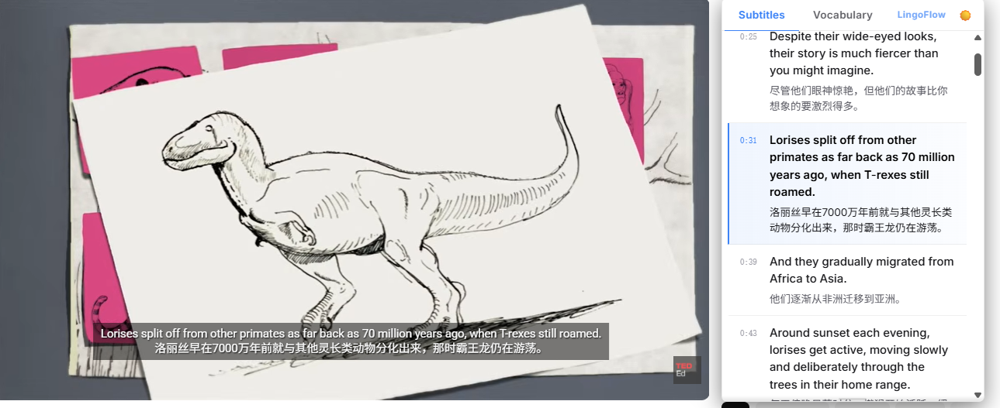
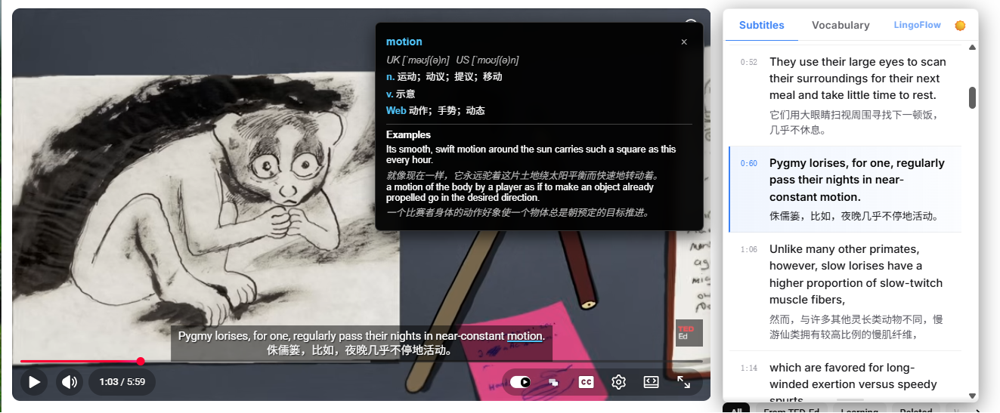

# LingoFlow (v1.0) — YouTube 双语字幕专业版

[English](./README.md) | [中文]

**LingoFlow** 是一款功能强大的浏览器扩展，通过实时双语字幕和智能语言学习工具提升您的 YouTube 体验。专为想要通过视频内容自然吸收语言的学习者、专业人士和多语言爱好者设计。

## ✨ 特性

### 🎬 沉浸式双语字幕
在任何 YouTube 视频下方无缝嵌入双语字幕。同时查看原始字幕和精准译文 — 无需频繁切换上下文。



### 📖 悬停翻译生词
将鼠标悬停在原始字幕中的任何单词上，即可立即显示读音、释义和例句。由微软词典提供动力，为您提供精准且符合语境的结果。



### ⏯️ 智能播放同步
当您探索新单词时，视频会自动暂停；当您的视线移开时，视频会自动恢复播放。在不遗漏任何细节的情况下进行学习。

### 📋 学习侧边栏
- **实时字幕列表**：完整的可滚动字幕列表，带有可点击的时间戳，可实现即时导航。
- **动态生词本**：自动收集您查过的每一个单词，并附带视频中的原始上下文。

### 📤 导出与复习
将您的单词本导出为 **JSON**、**CSV**、**TXT** 或 **Markdown** 格式 — 随时可导入 Anki、Notion 或任何学习流程。

### 🌐 多种翻译引擎
支持 Microsoft Translate、Google Translate、DeepL 等多种引擎。根据您的语言对选择最适合的翻译引擎。
### 🔒 安全绕过 CSP 限制
基于 Manifest V3 标准，利用浏览器原生的主页面世界（`world: "MAIN"`）内容脚本注入技术，在最早时机挂载字幕网络请求与 Shadow DOM 拦截器。这能彻底且 100% 安全地绕过 YouTube 页面严格的 CSP（Content Security Policy）拦截，确保本地和线上环境均能稳定解析到双语字幕。

## 🗂️ 项目结构

| 目录 | 描述 |
|---|---|
| `src/subtitle/` | 核心字幕渲染器、侧边栏 UI 和 YouTube 字幕提供程序 |
| `src/apis/` | 翻译和微软词典 API 集成 |
| `src/injectors/` | 低层请求拦截和 Shadow DOM 映射脚本 |
| `src/libs/` | 轻量级工具库 (日志、缓存、存储) |
| `src/config/` | 国际化 (i18n) 和全局配置 |

## 📦 下载与安装

### 📥 方式一：下载发布包直接安装（推荐普通用户）

1. 前往 GitHub 的 [Releases](https://github.com/TheBoringEnglish/TBE-YouTube/releases) 页面下载最新版本的 `.zip` 安装包（例如 `TBE-YouTube-v1.0.0.zip`）。
2. 将下载的压缩包解压到本地任意目录（解压后请勿删除或移动该目录）。
3. 打开 Chrome 浏览器，访问 `chrome://extensions/` 进入扩展程序管理页面。
4. 开启页面右上角的**“开发者模式”**开关。
5. 点击左上角的**“加载已解压的扩展程序”**按钮，选择刚才解压出来的文件夹即可完成安装。

---

### 💻 方式二：从源码编译开发安装（适合开发者）

#### 前提条件
- Node.js 18+
- npm 或 yarn

#### 步骤说明
1. 克隆本项目代码：
   ```bash
   git clone https://github.com/TheBoringEnglish/TBE-YouTube.git
   cd TBE-YouTube
   ```
2. 安装项目依赖：
   ```bash
   npm install
   ```
3. 开发模式运行（支持热更新）：
   ```bash
   npm start
   ```
4. 编译打包生产版本：
   ```bash
   npm run build
   ```
5. 打开 Chrome 扩展程序页面（`chrome://extensions/`），开启右上角**“开发者模式”**，点击左上角**“加载已解压的扩展程序”**，选择项目根目录中生成的 `dist/` 文件夹。


## 📜 开源协议与致谢

本项目基于 [fishjar/kiss-translator](https://github.com/fishjar/kiss-translator) 开发，并采用 [GPL-3.0](https://www.gnu.org/licenses/gpl-3.0.html) 协议开源。

---

由 **LingoFlow 团队** 用 ❤️ 构建
